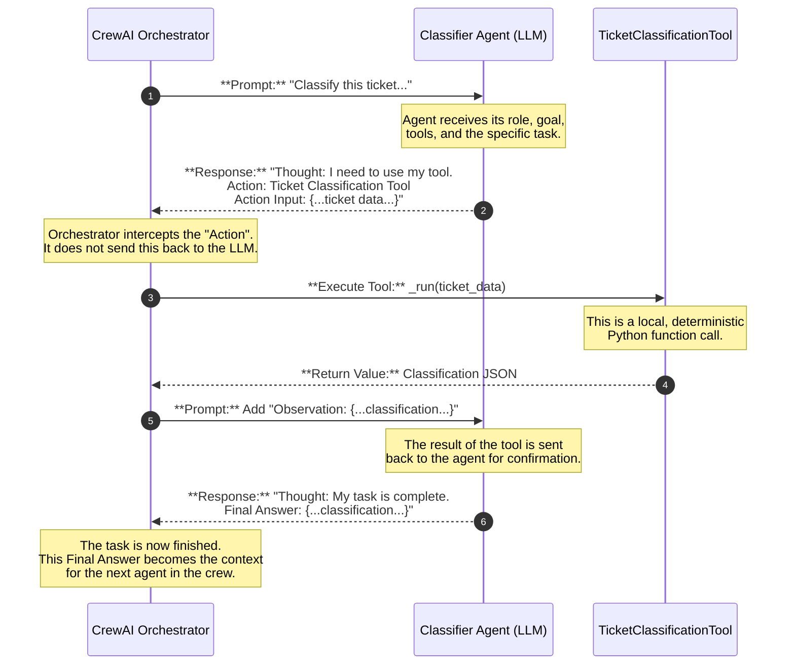
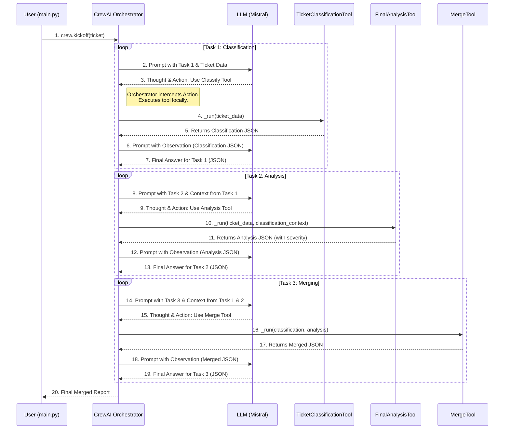

# Jira Tickets Triaging with Agentic AI 


An AI multi-agent system built with CrewAI to automatically triage Jira incident tickets. This project demonstrates a practical application of agentic AI workflows, showcasing how specialized agents can collaborate to perform complex tasks.

## 🚀 About This Project

In any IT organization, the first response to an incident is triage: understanding the problem, categorizing it, assessing its severity, and routing it to the right team. This is often a manual and time-consuming process.

This project builds an **Autonomous AI Triage Crew** to automate this entire workflow. The system takes a raw incident ticket as input, processes it through a sequential "assembly line" of specialized AI agents, and produces a structured, actionable triage report as its final output.

The primary goal of this repository is to serve as an educational tool to demystify Agentic AI. It shows that these powerful systems are a logical and understandable combination of:
*   **Large Language Models (LLMs)** for reasoning.
*   **Specialized Agents** with unique roles and goals.
*   **Deterministic Tools** that provide reliable capabilities.
*   **A Structured Process** that orchestrates the entire workflow.

## ✨ Key Features

*   **Autonomous Triage:** End-to-end processing of an IT ticket without human intervention.
*   **Specialized AI Agents:** Three distinct agents (Classifier, Analyzer, and Reporter) each handle a specific part of the triage process.
*   **Deterministic Tools:** Agents are equipped with simple, rule-based Python tools, ensuring reliability, speed, and consistency.
*   **Sequential Workflow:** The crew follows a logical, step-by-step process, where the output of one agent becomes the input for the next.
*   **Local LLM Powered:** Runs entirely locally using Ollama and the Mistral model, ensuring privacy and cost-effectiveness.

## 🏗️ System Architecture

The application is designed as a sequential pipeline. An incident ticket enters at the start, and a structured JSON report is produced at the end. Each agent in the crew acts as a station on this assembly line.


**The Agents:**

1.  **Incident Classification Specialist:** The first agent in the line. Its sole purpose is to analyze the ticket's title and description to determine its category (e.g., `Application`, `Infrastructure`) and add relevant tags.
2.  **Final Analysis Agent:** The second agent. It receives the classified ticket and assesses its severity level (e.g., `Critical`, `High`) based on keywords and context.
3.  **Triage Report Combiner:** The final agent. It takes the outputs from the previous agents and merges them into a single, clean, and comprehensive triage summary JSON.

## ⚙️ How It Works: A Deep Dive into the Agentic Flow

To understand how the crew functions, it's essential to look at the interactions between the orchestrator (CrewAI), the reasoning engine (the LLM), and the tools.

### A Single Agent's Mind: The ReAct Loop

The diagram below shows the fundamental **ReAct (Reason and Act)** cycle that each agent follows. This is the core engine of the entire system.



### The Complete Crew Data Flow

This sequence diagram shows how all three agents work together, passing context from one to the next until the final report is generated.



## 🛠️ Technology Stack

*   **Agentic Framework:** [CrewAI](https://www.crewai.com/)
*   **LLM Orchestration:** [LangChain](https://www.langchain.com/)
*   **Local LLM Provider:** [Ollama](https://ollama.ai/)
*   **Language Model:** [Mistral 7B](https://mistral.ai/news/announcing-mistral-7b/)
*   **Core Language:** [Python](https://www.python.org/)

## 🏁 Getting Started

Follow these steps to run the AI Triage Crew on your local machine.

### Prerequisites

1.  **Python 3.10+**
2.  **Ollama:** You must have Ollama installed and running. Follow the instructions at [ollama.ai](https://ollama.ai/).
3.  **Mistral LLM:** Pull the Mistral model for Ollama by running:
    ```bash
    ollama pull mistral
    ```

### Installation & Execution

1.  **Clone the Repository:**
    
    git clone https://github.com/Natarajan-R/Jira-Triaging-with-AI-Agents
    cd Jira-Triaging-with-AI-Agents
    

2.  **Create a Virtual Environment:**
    
    python3 -m venv .venv
    source .venv/bin/activate


3.  **Install Dependencies:**
    
    pip install -r requirements.txt
    

4.  **Run the Application:**
    
    python main.py
    

The script will execute the crew, and you will see the detailed thought process of each agent printed to the console, followed by the final merged JSON output.

## 🎓 Key Learnings from this Project

This project was a fantastic learning experience. The most valuable lessons were not in the final success, but in the debugging and refinement process.

1.  **Model Selection is Everything:** My initial attempts with a different local model (`phi3`) failed completely, resulting in hallucinations. This demonstrated that a model's ability to follow the structured `ReAct` (Reason and Act) prompt format is a critical, non-negotiable requirement for agentic work.
2.  **Deterministic Tools are More Reliable:** While it's tempting to use LLMs for every task, I found that replacing complex reasoning with simple, rule-based Python functions for my tools made the system dramatically more reliable, faster, and cheaper to run. The true power of an agent is its ability to *decide which tool to use*, not necessarily in performing the action itself.
3.  **The Orchestrator is as Important as the Agent:** Debugging issues like a `null` `ticket_id` in the final output revealed that the agent and LLM can perform perfectly, but bugs in the tool's implementation (the orchestration code) can still break the data flow.
4.  **The Non-Deterministic Nature of LLMs:** Even when a system works, it's crucial to plan for unpredictability. Implementing output validation (e.g., with Pydantic) to create "quality gates" between agents is a vital step for moving from a prototype to a production-ready application.

## 🚀 Next Steps

This project serves as a strong foundation. Future improvements could include:
*   **Implementing Robust Output Validation:** Adding Pydantic validation schemas after each task to ensure data integrity and create a resilient, self-correcting workflow.
*   **Adding a Web Interface:** Using a framework like Streamlit or Gradio to create a simple UI for submitting tickets and viewing the triage results.
*   **Expanding Tool Capabilities:** Adding more sophisticated tools, such as a tool to look up past incidents in a vector database to find similar tickets.

---

Feel free to clone, experiment, and share your feedback!
